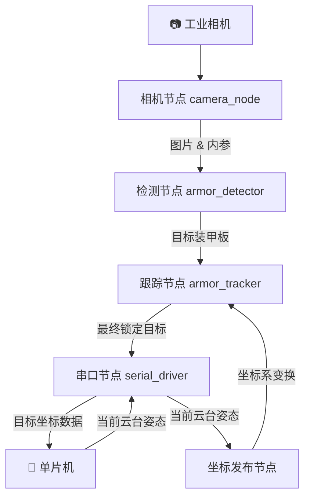
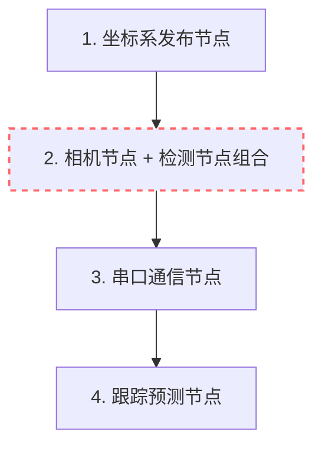

# rm_vision 学习指南 — Part 1：项目全貌与数据流

---

## 一、这个项目到底在干什么？

**一句话概括**：`rm_vision` 是一套让 RoboMaster 机器人“看到敌人装甲板，并自动锁定跟踪”的视觉系统。

打个比方：你可以把它理解成一套“自动瞄准辅助系统”，就像一些射击游戏里的“锁定功能”——

1. **相机**不断拍照（每秒几十到几百帧）
2. **识别器**在每一帧照片里找到敌人身上发光的“装甲板”（就是那两条 LED 灯条 + 中间的数字牌）
3. **跟踪器**记住敌人的位置，即使某一帧没看到，也能“猜”出敌人在哪
4. **串口**把最终的目标位置发给下位机（电控的 STM32 单片机），让云台转过去瞄准

---

## 二、项目的文件夹结构

整个工作空间 `src/` 下有 **6 个子包**，每个都是独立的 ROS 2 package（可以理解为一个独立的功能模块）：

```text
rm_vision_ws/src/
├── rm_vision/               # 🎯 主项目：启动文件和总配置
│   └── rm_vision_bringup/   #    launch 文件 + 参数配置
│
├── rm_auto_aim/             # 🧠 核心算法（最重要，代码量最大）
│   ├── armor_detector/      #    装甲板检测器（从图片中找装甲板）
│   ├── armor_tracker/       #    装甲板跟踪器（跟踪 + 预测目标）
│   ├── auto_aim_interfaces/ #    消息接口定义（节点之间传什么数据）
│   └── auto_aim_bringup/    #    算法模块的启动文件
│
├── rm_serial_driver/        # 🔌 串口通信（视觉 ↔ 电控的桥梁）
├── rm_gimbal_description/   # 🤖 云台模型描述（URDF，坐标系定义）
├── ros2_hik_camera/         # 📷 海康威视相机驱动
└── ros2_mindvision_camera/  # 📷 迈德威视相机驱动
```

> **学习建议**：你日常学习时，**80% 的时间**应该花在 `rm_auto_aim/` 这个目录下，它是整个项目的算法核心。其他模块（相机驱动、串口、云台模型）更像是“外设配件”。

---

## 三、ROS 2 节点与数据流

### 3.1 什么是“节点”和“话题”？

考虑到你准备转行，用最通俗的话说在 ROS 2 里：
- **节点（Node）** = 一个独立运行的小程序，只负责干好一件事（比如只负责识别照片）
- **话题（Topic）** = 程序之间传递数据的“快递通道”。只要连上同一个通道，一个程序发数据，另一个程序就能收到。

### 3.2 整体数据流（从拍照到瞄准）

下面这张图展示了数据从相机一路流到电控单片机的完整过程：



### 3.3 每一步在做什么？

| 步骤 | 节点名称 | 做了什么 |
|------|---------|---------|
| **① 拍照** | `camera_node` | 驱动相机，不断采集图像 |
| **② 检测** | `armor_detector` | 在图像中找到所有装甲板，算出它们的 3D 相对位置 |
| **③ 跟踪** | `armor_tracker` | 选定一个目标持续跟踪，并在这个目标被遮挡时预测它下一刻的位置 |
| **④ 通信** | `serial_driver` | 把目标信息发给单片机，同时接收云台当前的真实指向 |

---

## 四、消息接口详解（节点之间传的是什么？）

可以直接在 VS Code 里点击下方的蓝色链接，跳转至对应的源码。

### 4.1 单个装甲板：`Armor.msg`
👉 **查看源码：[Armor.msg](../src/rm_auto_aim/auto_aim_interfaces/msg/Armor.msg)**
```text
string number                    # 装甲板上的数字（如 "1", "3", "guard"）
string type                      # 装甲板类型（"small" 小装甲 / "large" 大装甲）
float32 distance_to_image_center # 装甲板离画面中心的距离（用于判断优先打哪一个）
geometry_msgs/Pose pose          # 🎯 装甲板的 3D 位置和朝向
```
> **打比方**：这就好比一张“敌人名片”——上面写了“我是几号”、“我在哪”。检测节点每一张照片都会找出好几张这样的名片。

### 4.2 一帧里的所有装甲板：`Armors.msg`
👉 **查看源码：[Armors.msg](../src/rm_auto_aim/auto_aim_interfaces/msg/Armors.msg)**
```text
std_msgs/Header header    # 时间戳 + 坐标系信息
Armor[] armors            # 装甲板名片盒（这一帧照片里检测到的所有装甲板名片）
```

### 4.3 最终跟踪目标：`Target.msg`
👉 **查看源码：[Target.msg](../src/rm_auto_aim/auto_aim_interfaces/msg/Target.msg)**
```text
std_msgs/Header header         # 时间戳
bool tracking                  # 当前是否正在跟踪目标（如果丢了目标就是 false）
string id                      # 目标ID（哪个机器人）
int32 armors_num               # 目标有几块装甲板（2=平衡步兵, 3=前哨站, 4=普通步兵）
geometry_msgs/Point position   # 🎯 目标的最终 3D 空间位置 (x, y, z)
geometry_msgs/Vector3 velocity # 🎯 目标的速度 (vx, vy, vz)，用于预测前置量
float64 yaw                    # 目标朝向角
float64 v_yaw                  # 目标旋转角速度（打“小陀螺”的关键）
# ... 其他几何参数（半径、高度差等）
```
> **打比方**：这是跟踪器算出的“敌人运动综合情报”。不仅告诉你敌人在哪，还告诉你敌人以多快的速度在往哪个方向跑。

### 4.4 串口数据包：视觉与电控的“信使”
👉 **查看源码：[packet.hpp](../src/rm_serial_driver/include/rm_serial_driver/packet.hpp)**

**电控发给视觉（`ReceivePacket`）**：
- `detect_color`：告诉视觉“我们现在是红方，你需要打蓝色！”
- `roll, pitch, yaw`：当前真实的云台姿态角度（告诉视觉相机正对着哪）。

**视觉发给电控（`SendPacket`）**：
- `tracking`、`id` 等目标基础信息。
- `x, y, z`、`vx, vy, vz` 等位置和速度情报。

> **⚠️ 特别注意**：很多新手会误解，由于视觉组叫做“自瞄组”，以为瞄准全在视觉系统里算。其实为了保证实时性，距离修正、重力下坠补偿导致的**最终弹道解算**（枪管到底抬高几度才能打中），**不在视觉端完成**，而是在电控的 STM32 芯片里做的。视觉端可以说是“只管报点”。

---

## 五、Launch 启动顺序关系

当你向系统下达总启动指令时，系统会按以下层级启动（纵向精简图）：


> **C++ 开发进阶知识**：在这套系统里，相机节点和检测节点被“打包”放在了同一个进程（容器）里，图中我用红框标出了。这样它们传递图片数据时，就不需要再在内存里搬运一次数据。这在 C++ 进程间通信（IPC）里叫做**零拷贝（Zero Copy）**，通过指针传递，极其节省电脑算力，能有效提高处理帧率。

---

## 六、关键源文件速查表（点击直达）

带 `⭐` 的文件是你接下来入门 C++ 项目逻辑的重点目标。

### 🧠 装甲板检测器（寻找目标）
| 文件 | 作用说明 |
|------|---------|
| ⭐ **[detector_node.cpp](../src/rm_auto_aim/armor_detector/src/detector_node.cpp)** | 检测模块的总管：负责“进货”和“出货”（接收图片、回调算法、发散装甲板位置） |
| ⭐ **[detector.cpp](../src/rm_auto_aim/armor_detector/src/detector.cpp)** | 核心算法：提取灯条 -> 筛选假发光点 -> 将亮条配对成装甲板 |
| **[number_classifier.cpp](../src/rm_auto_aim/armor_detector/src/number_classifier.cpp)** | AI 模型：调用神经网络识别灯条中间的数字 |
| **[pnp_solver.cpp](../src/rm_auto_aim/armor_detector/src/pnp_solver.cpp)** | PnP解算：将二维像素图还原成三维空间位置 |

### 🎯 装甲板跟踪器（预测位置）
| 文件 | 作用说明 |
|------|---------|
| ⭐ **[tracker_node.cpp](../src/rm_auto_aim/armor_tracker/src/tracker_node.cpp)** | 跟踪模块的总管：负责接收所有碎片的装甲板，并发送计算完毕的最终目标 |
| ⭐ **[tracker.cpp](../src/rm_auto_aim/armor_tracker/src/tracker.cpp)** | 在几帧不同时间的画面间匹配同一个目标（它去哪了？） |
| **[extended_kalman_filter.cpp](../src/rm_auto_aim/armor_tracker/src/extended_kalman_filter.cpp)** | 卡尔曼滤波数学实现：对运动目标做预测打量 |

### 🔌 串口通信（底层对话）
| 文件 | 作用说明 |
|------|---------|
| **[rm_serial_driver.cpp](../src/rm_serial_driver/src/rm_serial_driver.cpp)** | 配合上面的 `packet.hpp` 负责实现串口的 C++ 读写逻辑 |
